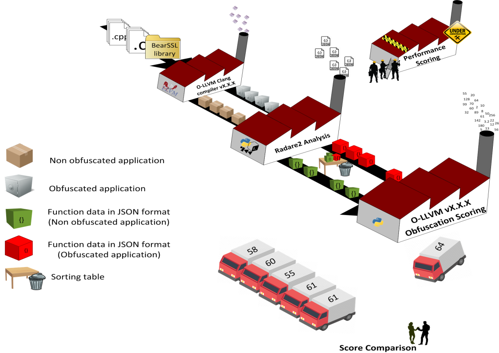
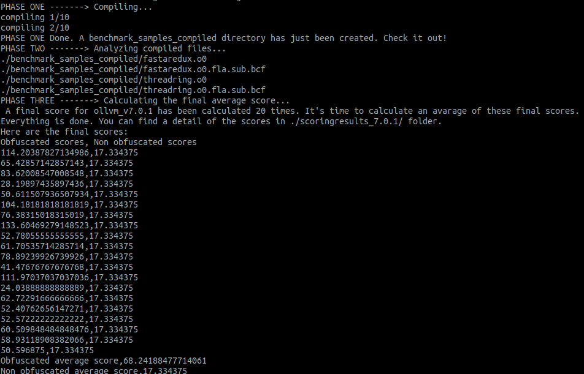

# OLLVM_reliability


*OLLVM_reliability* is a project that aims to provide suppport to the developpers of [OLLVM](https://github.com/ita-msc/obfuscator), an open source obfuscator.

When a modification on OLLVM is pushed, this project will automaticcaly be triggered and start the assessment of the latest OLLVM version. At the end of the evaluation, a score is provided to developers as a reliability indicator, which will be tracked over time with each version of ollvm.

### How it works, the assesment protocol:
A given OLLVM version is evaluated according to this three-phases protocol:
1) A sample of various programs are compiled with and without obfuscation. The compiler of OLLVM is called Clang.
2) The **compiling** phase is then followed by the **analysis** one. The output thus obtained is filtered before giving a score. 
3) The **scoring** phase is the last one and provide the final reliability indicator for the given OLLVM version.



### How it is organized:
* __```allthejob.bash```:__ does the compiling phase, and calls the useful python scripts for the analysis phase and the scoring phases. 
It invokes the following scripts:  
    * ```radare2Analysis_Filtering_and_Scoring.py```
    * ```scoring.py```
    * ```finalScoresCollector.py```
    * ```averageScores.py```
<br/>

* __```radare2Analysis_Filtering_and_Scoring.py```:__ gets a compiled program and analyses it with [radare2](https://github.com/radare/radare2). radare2 provides a large amount of data about each function called in the program. This script sorts the data from a "scoring formula" which may evolve and can easily be changed. The filtered set of data is sent to the ```scoring.py``` script.
<br/>

* __```scoring.py```:__ calculates an average score for each program, obfuscated and not obfuscated and returns two average scores: one for the obfuscated programs and another one for the non obfuscated ones. the output file then contains a detailed view of all scores per programs, and stwo average scores.
<br/>

* __```finalScoresCollector.py```:__ gathers all obfuscated average scores and non-obfuscated average scores obtained after running the assessment protocol i times. This script will, in the same way as ```scoring.py```, calculates two averages (obfuscated and non obfuscated) from the i scores.
<br/>
* __```/benchmak_samples```__: contains the source code of the programs that will be compiled with the assessed version of ollvm.
<br/>

The other programs in the /OLLVM_reliability folder represents the track of the work done before reaching the current version:

* __```radare2OutputFormatting.py```:__
* __```radare2Analysis_and_OutputFiltering-v1/2.py```:__
* __```performanceAnalysis.py```:__
### How to test _OLLVM_reliability_:
The prerequisite are having an ollvm version installed
After cloning the _OLLVM_reliability_ project, the only command you need to run is:
```bash
bash allthejob.bash
```
The expected output should look like:


### What is worth reviewing:
* __the number and variety of programms in /benchmark_samples:__ the more programs you have tested vy thhe compiler, the better. 
+ scoring formula+performance 

### Contributors:
Anaïs NALEM, 4th-year student at INSA Centre Val de Loire contributed from April to July 2019